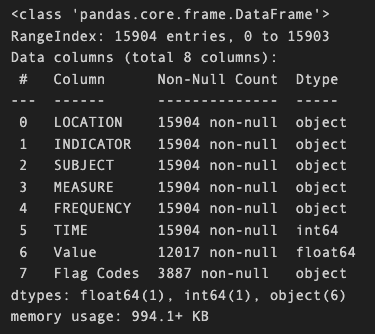
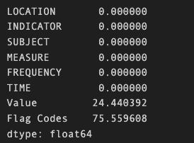
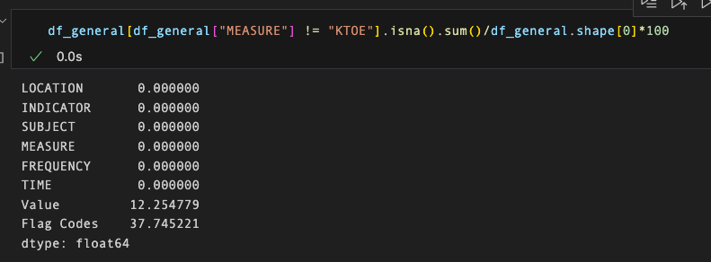
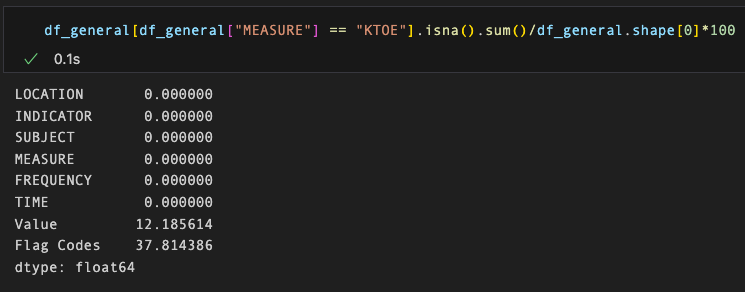
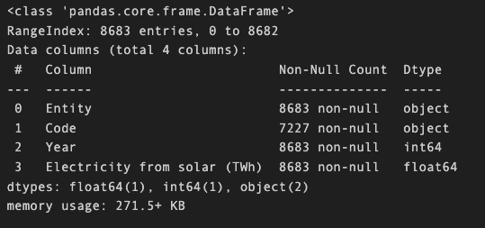
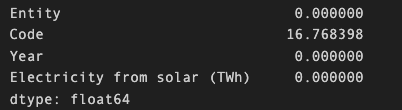

# Documentation 

## Dataset: `Renewable Energy (1960-2023)`

[Fuente](https://www.kaggle.com/datasets/imtkaggleteam/renewable-energy-1960-2023/data)

### Exploratory data analysis:

### 1. Data type:

--> All `dtypes` are correct.

### 2.  Identifying null values:

We have same nulls percentage filtering by "MEASURE" == "`KTOE`" or "MEASURE" == "`PC_PRYENRGSUPPLY`":

### 3.  Identifying duplicates:
--> no duplicates.

### 4.  Modifications:

Identifying interesting columns in dataset:

- Dataset columns to be deleted:
    - `Indicator`: one unique value == `RENEWABLE`
    - `Frequency`:  one unique value == `A`
    - `Subject`: one unique value == `TOT`
    - `Flagcodes`: 75% nulls
    - `Measure`: we are only interested in the column `PC_PRYENRGSUPPLY` (== `percentage of total primary energy supply`). We delete the other measure.

- Dataset columns interesting:
    - `value`: we rename it as `total_energy_supply`.

## Dataset: Renewable Energy World Wide : 1965~2022 
[Fuente](https://www.kaggle.com/datasets/belayethossainds/renewable-energy-world-wide-19652022/data?select=01+renewable-share-energy.csv)

### `12-solar-energy-consumption.csv`:

### 1. Data type:

--> All `dtypes` are correct.

### 2.  Identifying null values:

We have same nulls percentage filtering by "MEASURE" == "`KTOE`" or "MEASURE" == "`PC_PRYENRGSUPPLY`":

### 3.  Identifying duplicates:
--> no duplicates.

### 4.  Modifications:

Identifying interesting columns in dataset:

- Dataset columns to be deleted:
    - `Indicator`: one unique value == `RENEWABLE`
    - `Frequency`:  one unique value == `A`
    - `Subject`: one unique value == `TOT`
    - `Flagcodes`: 75% nulls
    - `Measure`: we are only interested in the column `PC_PRYENRGSUPPLY` (== `percentage of total primary energy supply`). We delete the other measure.

- Dataset columns interesting:
    - `value`: we rename it as `total_energy_supply`.

